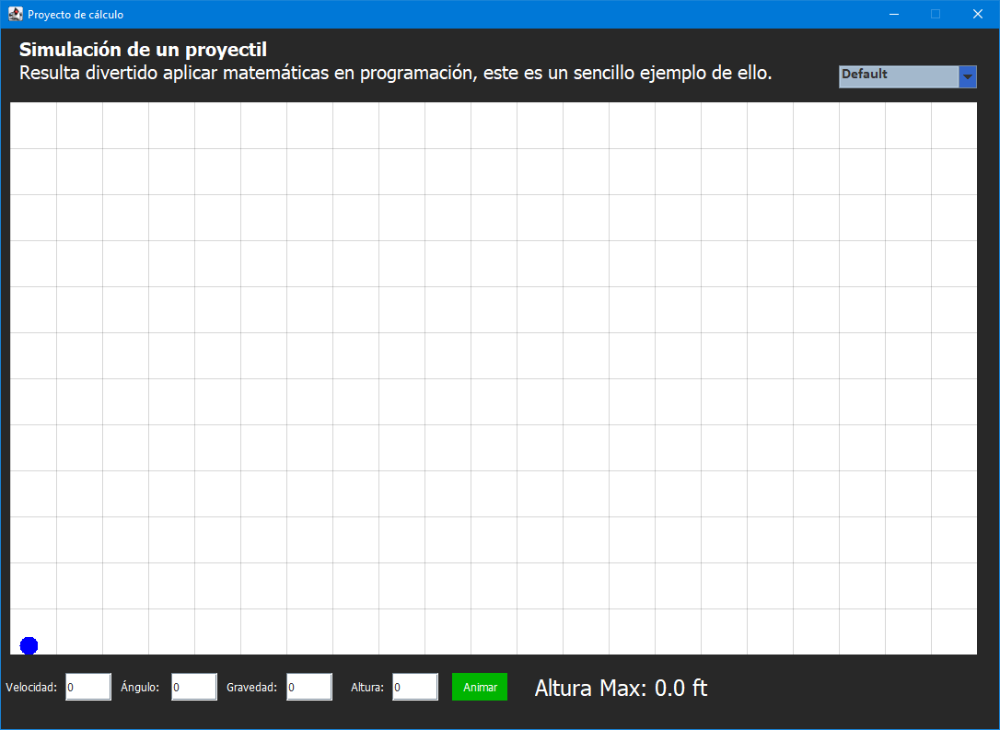
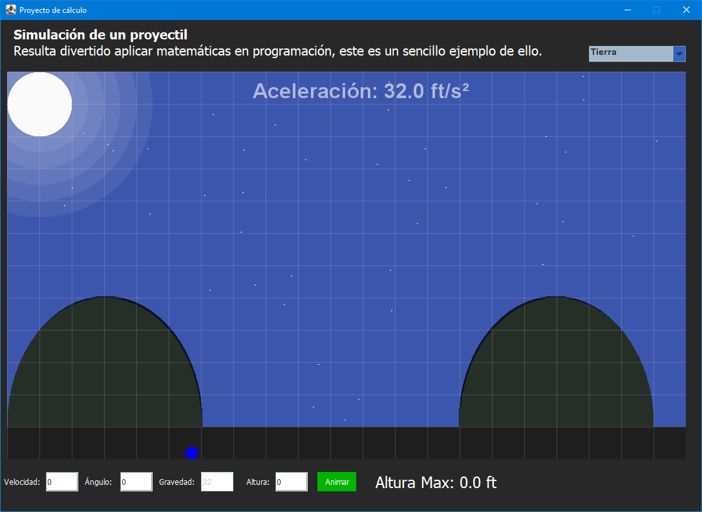
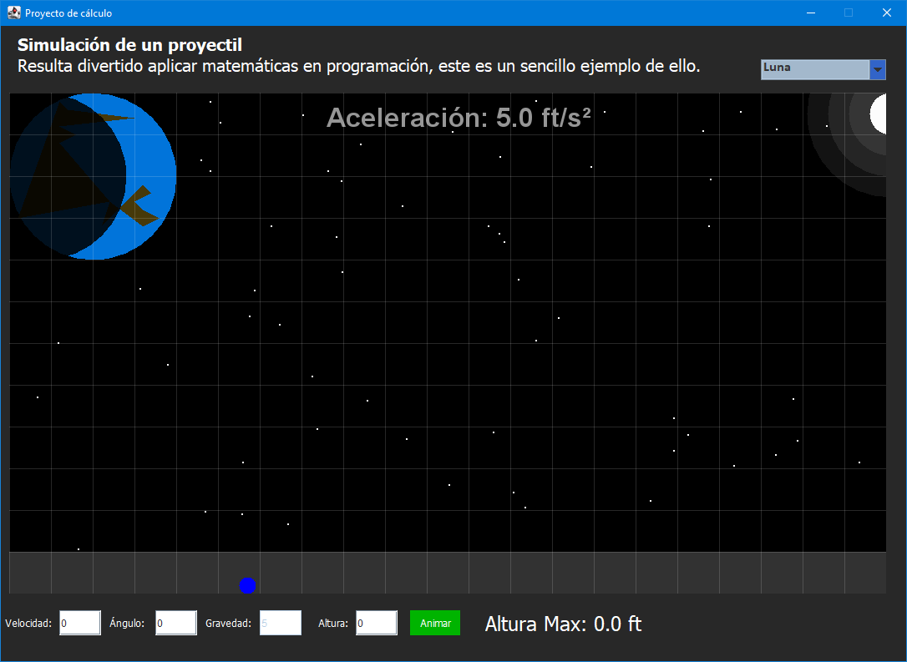
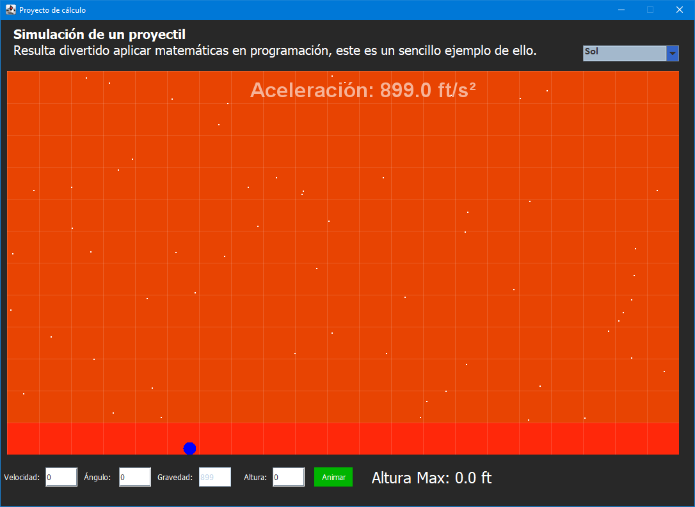
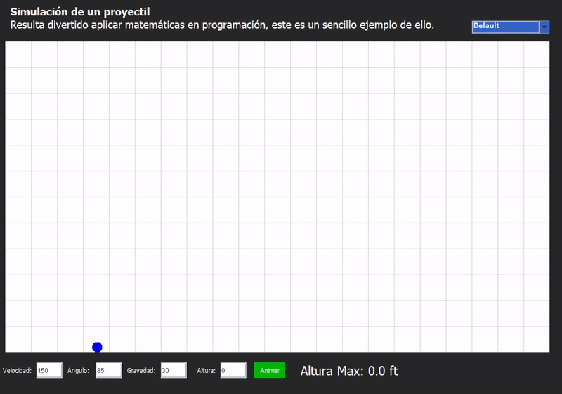

# Desplazamiento de un proyectil (Simulación)

Implementación de un sencillo simulador del desplazamiento de un proyectil en diferentes escenarios (personalizado, tierra, luna y sol), el proyecto ha sido desarrollado completamente en Java, todos los gráficos mostrados han sido creados programáticamente. 

 

### Características del proyecto 

- Maven como herramienta de construcción de proyectos
- Java 11

 
 

## Pantallas del programa

 

> Default stage

 

> Earth stage

 

> Moon stage

 

> Sun stage

 
 

## Demostración de la dinámica del programa

 

